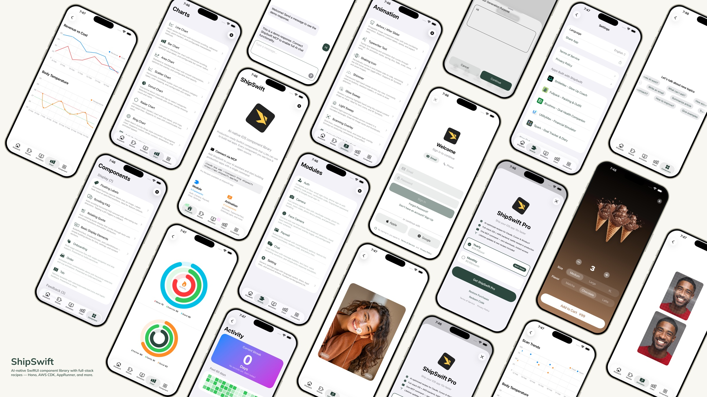

# ShipSwift

<div align="center">



**AI-native SwiftUI component library — production-ready code that LLMs can use to build real apps.**

[](https://opensource.org/licenses/MIT)
[](https://swift.org)
[](https://developer.apple.com/ios/)
[](https://github.com/signerlabs/shipswift-skills)

[Quick Start](#quick-start) · [Components](#components) · [Directory Structure](#directory-structure) · [Recipes](#recipes) · [Contributing](#contributing)

</div>

---

## Quick Start

### Option 1: Skills / Plugin (Recommended)

Install ShipSwift Skills so your AI assistant can access all components and recipes instantly:

**Universal (works with any AI tool)**
```bash
npx skills add signerlabs/shipswift-skills
```

**Claude Code**
```bash
/plugin marketplace add signerlabs/shipswift-skills
/plugin install shipswift
```

**Platform-Specific**

| Platform | Install Command |
|----------|----------------|
| **Cursor** | `npx skills add signerlabs/shipswift-skills -a cursor` |
| **VS Code Copilot** | `npx skills add signerlabs/shipswift-skills -a github-copilot` |
| **Windsurf** | `npx skills add signerlabs/shipswift-skills -a windsurf` |
| **Gemini CLI** | `gemini skills install https://github.com/signerlabs/shipswift-skills.git` |

Then just ask your AI:
- "Add a shimmer loading animation"
- "Build an authentication flow with Cognito"
- "Show me all chart components"

### Option 2: File Copy

1. Clone this repository
2. Copy the files you need from `ShipSwift/SWPackage/` into your Xcode project
3. Each component in `SWAnimation/`, `SWChart/`, and `SWComponent/` is self-contained — just copy the file and `SWUtil/` if needed

<details>
<summary><strong>Advanced: Manual MCP Setup</strong></summary>

If you prefer configuring the MCP server directly instead of using Skills:

**Claude Code**
```bash
claude mcp add --transport http shipswift https://api.shipswift.app/mcp
```

**Gemini CLI**
```bash
gemini mcp add --transport http shipswift https://api.shipswift.app/mcp
```

**Cursor** — Add to `.cursor/mcp.json`:
```json
{
  "mcpServers": {
    "shipswift": {
      "type": "streamableHttp",
      "url": "https://api.shipswift.app/mcp"
    }
  }
}
```

**VS Code Copilot** — Add to `.vscode/mcp.json`:
```json
{
  "servers": {
    "shipswift": {
      "type": "http",
      "url": "https://api.shipswift.app/mcp"
    }
  }
}
```

**Windsurf** — Add to `~/.codeium/windsurf/mcp_config.json`:
```json
{
  "mcpServers": {
    "shipswift": {
      "serverUrl": "https://api.shipswift.app/mcp"
    }
  }
}
```

</details>

### Run the Showcase App

```bash
git clone https://github.com/signerlabs/ShipSwift.git
cd ShipSwift
open ShipSwift.xcodeproj
```

Select a simulator or device, then press **Cmd+R** to build and run.

---

## Components

### SWAnimation — 9 Animation Components

BeforeAfterSlider · TypewriterText · ShakingIcon · Shimmer · GlowSweep · LightSweep · ScanningOverlay · AnimatedMeshGradient · OrbitingLogos

### SWChart — 8 Chart Components

LineChart · BarChart · AreaChart · DonutChart · RingChart · RadarChart · ScatterChart · ActivityHeatmap

### SWComponent — 15 UI Components

**Display:** FloatingLabels · ScrollingFAQ · RotatingQuote · BulletPointText · GradientDivider · Label · OnboardingView · OrderView · RootTabView
**Feedback:** Alert · Loading · ThinkingIndicator
**Input:** TabButton · Stepper · AddSheet

### SWModule — 5 Multi-File Frameworks

- **SWAuth** — User authentication (Amplify/Cognito, social login, email/password, phone sign-in with country code picker)
- **SWCamera** — Camera capture with viewfinder, zoom, photo picker, and face detection with Vision landmark tracking
- **SWPaywall** — Subscription paywall using StoreKit 2
- **SWChat** — All-in-one chat view with message list, text input, and optional voice recognition (VolcEngine ASR)
- **SWSetting** — Settings page template with language switch, share, legal links, recommended apps

### SWUtil — Shared Utilities

DebugLog · String/Date/View extensions · LocationManager

---

## Directory Structure

```
ShipSwift/
├── SWPackage/
│   ├── SWAnimation/          # Animation components (9 files)
│   ├── SWChart/              # Chart components (8 files)
│   ├── SWComponent/          # UI components (15 files)
│   │   ├── Display/          #   Display components (9)
│   │   ├── Feedback/         #   Feedback components (3)
│   │   └── Input/            #   Input components (3)
│   ├── SWModule/             # Multi-file frameworks (5 modules)
│   │   ├── SWAuth/           #   Authentication (4 files)
│   │   ├── SWCamera/         #   Camera + face detection (4 files)
│   │   ├── SWPaywall/        #   Subscription paywall (2 files)
│   │   ├── SWChat/           #   Chat + voice input (4 files)
│   │   └── SWSetting/        #   Settings page (1 file)
│   └── SWUtil/               # Shared utilities (5 files)
├── View/                     # Showcase app views
└── Component/                # Shared app components
```

---

## Naming Convention

All types use the `SW` prefix (e.g., `SWAlertManager`, `SWStoreManager`).
View modifiers use `.sw` lowercase prefix (e.g., `.swAlert()`, `.swPageLoading()`, `.swPrimary`).

## Dependency Rules

```
SWUtil        ← no dependencies on other SWPackage directories
SWAnimation   ← may depend on SWUtil only
SWChart       ← may depend on SWUtil only
SWComponent   ← may depend on SWUtil only
SWModule      ← may depend on SWUtil and SWComponent
```

---

## Recipes

ShipSwift provides **38 free recipes** via Skills — each recipe includes complete SwiftUI source code, implementation steps, and best practices. Your AI assistant can retrieve any recipe on demand.

| Category | Count | Examples |
|----------|-------|----------|
| Animation | 9 | Shimmer, Typewriter, Orbiting Logos |
| Chart | 8 | Line, Bar, Donut, Radar, Heatmap |
| Component | 15 | Alert, Onboarding, Stepper, FAQ |
| Module | 6 | Auth, Camera, Chat, Setting, Subscription, Infra CDK |

Three tools are available: `listRecipes`, `getRecipe`, `searchRecipes`.

Learn more at [shipswift.app](https://shipswift.app) · Skills repo: [signerlabs/shipswift-skills](https://github.com/signerlabs/shipswift-skills)

---

## Tech Stack

- SwiftUI + Swift
- StoreKit 2
- Amplify SDK (Cognito)
- AVFoundation + Vision
- SpriteKit
- VolcEngine ASR

---

## Contributing

Contributions are welcome! Please follow these steps:

1. Fork the repository
2. Create a feature branch (`git checkout -b feature/amazing-feature`)
3. Commit your changes (`git commit -m 'Add amazing feature'`)
4. Push to the branch (`git push origin feature/amazing-feature`)
5. Open a Pull Request

### Code Style

- All comments and documentation in English
- All types use the `SW` prefix
- Each file in `SWAnimation/`, `SWChart/`, and `SWComponent/` must be self-contained
- Follow existing code patterns and naming conventions

---

## License

This project is licensed under the MIT License — see the [LICENSE](LICENSE) file for details.

---

<div align="center">

Made with ❤️ by [SignerLabs](https://github.com/signerlabs)

</div>


## Installation

```bash
# Installation instructions
```


## Usage

```python
# Usage examples
```
